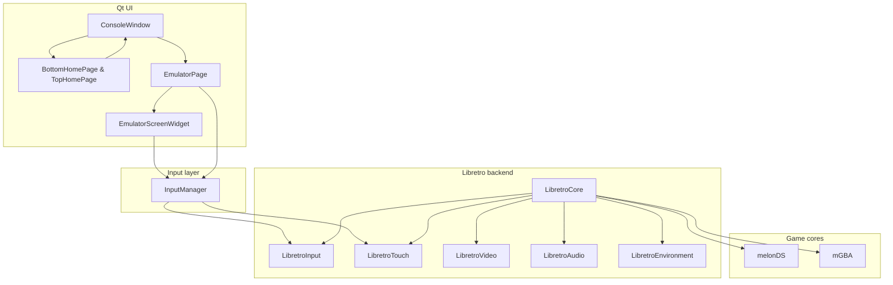
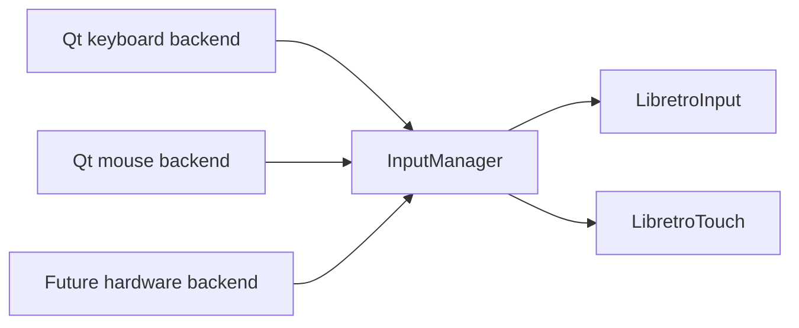

<p align="center">
	
</p>

# Pulsar Homemade Console

Pulsar is a software console built on Qt and libretro. The project already runs as a complete launcher plus emulator stack, with the input path centralized so the same core can later be driven by different hardware sources.

The codebase is split across a few stable areas:

- Qt UI for navigation, launcher pages, and emulator screens
- libretro backend for core loading, video, audio, and input callbacks
- `InputManager` as the global input state shared by every backend
- hardware-independent module boundaries that keep the project ready for future GPIO, USB HID, or touchscreen drivers

The current runtime is made of two main pieces: a Qt launcher for browsing the library and a dedicated emulator page that runs libretro cores. Keyboard and touch events already flow through the shared `InputManager`, so the emulator side does not depend on Qt-specific event types.

## Overview



## Architecture

The project is organized into a small set of clear modules under `src/`:

- `src/ui` contains the Qt interface.
- `src/emulator` contains the emulator pipeline and the libretro backend.
- `src/input` contains the shared global input state.
- `src/library` handles ROM discovery and classification.
- `src/audio` wraps application-side audio playback.

The UI stays focused on presentation and user interaction, while the emulator backend works from a shared input state instead of Qt event objects. That split keeps the codebase easy to extend without coupling the emulator layer to one specific front-end input source.

## Runtime Flow

### 1. Launcher

`ConsoleWindow` orchestrates the main UI screens. On startup it shows the splash screen, then switches to the launcher.

The visible launcher pages are:

- `TopScreen`, which shows the current title or page information
- `BottomScreen`, which hosts the interactive content
- `BottomHomePage`, which handles library navigation and game launch

The launcher is part of the Qt UI layer, while game selection and emulation stay separated in different pages.

### 2. Starting a game

When a game is launched:

1. `ConsoleWindow` creates an `EmulatorPage`.
2. `EmulatorPage` initializes `EmulatorManager` for the selected console.
3. `EmulatorManager` resolves the matching core through `CoreRegistry`.
4. `LibretroCore` loads the shared library and wires the libretro callbacks.
5. The ROM is loaded.
6. A `QTimer` drives `runFrame()` at a fixed interval.

### 3. Emulation loop

Each frame follows the same pattern:

- `LibretroCore::runFrame()` calls `retro_run()`
- the core requests input state through `retro_set_input_state`
- `LibretroInput` and `LibretroTouch` read from `InputManager`
- `LibretroVideo` stores the rendered frame
- `LibretroAudio` receives the generated samples

## Libretro Backend

The libretro backend is the bridge between Pulsar and the external emulator cores.

### `LibretroCore`

`LibretroCore` loads the core library, resolves the required symbols, and registers the callbacks for:

- video refresh
- audio sample
- audio sample batch
- input poll
- input state

It provides the core runtime operations:

- load the core
- initialize the core
- load a ROM
- execute one frame
- save and unload game state

### `LibretroEnvironment`

`LibretroEnvironment` handles libretro environment callbacks. It is where the frontend answers core requests such as supported capabilities and basic frontend services.

### `LibretroVideo`

`LibretroVideo` stores frames received from libretro and exposes them to the Qt widgets. It also supports the dual-screen layout used by consoles such as the NDS.

### `LibretroAudio`

`LibretroAudio` receives samples from the core and forwards them to the application audio layer.

## Input Management

### Shared state

Input is not read directly from Qt by the emulator backend. Qt events update `InputManager`, and the libretro callbacks read the current global state from there.

Architecture:



### `InputManager`

`InputManager` is the single source of truth for buttons and touch state.

It stores:

- game buttons (`A`, `B`, `Start`, `Select`, directions, `L`, `R`)
- touch pressed state
- current touch coordinates

The Qt emulator page writes into this object today. A hardware backend can write into the same API later without changing the emulator or libretro layers.

### Raspberry Pi GPIO

On Linux, when the `libgpiod` development library is available at CMake configuration time, Pulsar enables its GPIO input backend. Install it on Raspberry Pi OS with:

```sh
sudo apt install libgpiod-dev
```

The first physical button uses BCM GPIO 17 (physical pin 11), configured as an input with its internal pull-up enabled. Connect the other side of the normally-open button to GND (physical pin 6). A falling edge produces a press and a rising edge produces a release; it is published through `InputManager` as the existing `A` button.

### `LibretroInput`

`LibretroInput` translates libretro joypad requests into the current state stored by `InputManager`.

The current Qt key mapping is:

- `Z` -> `A`
- `X` -> `B`
- `Enter` -> `Start`
- `Shift` -> `Select`
- arrow keys -> directions
- `A` -> `L`
- `S` -> `R`

The libretro core never sees Qt directly. It only sees a libretro-style button state.

### `LibretroTouch`

`LibretroTouch` translates libretro pointer requests into the shared touch state. Touch coordinates are normalized from the current content size into the coordinate space expected by the core.

## UI and Screens

### Launcher

The launcher is made of two main views:

- the top side, which shows the selected game title
- the bottom side, which shows the library and user interaction area

`BottomHomePage` handles:

- left/right navigation in the library
- centering the active tile
- launching a game
- menu music playback

### Emulator page

`EmulatorPage` hosts the running game session and creates one widget per logical screen:

- a main screen
- a secondary screen when the selected console has one

`EmulatorScreenWidget`:

- draws the frame received from the core
- maps Qt mouse input to content coordinates for touch handling
- updates `InputManager` with touch movement and press state

### Screen handling

The number of screens and the presence of touch support come from the console profile in `ConsoleProfile`.

Examples:

- NDS: two screens, touch enabled
- GBA: one screen, no touch

That keeps the UI logic simple and centralizes console-specific behavior in one place.

## Console Management

`CoreRegistry` maps each console to its libretro core. `EmulatorManager` uses that mapping to build the launch pipeline for the selected game.

The result is a simple relationship:

- one console -> one profile
- one profile -> one screen and input configuration
- one core -> one libretro shared library

## Future Hardware Support

The input architecture is already ready for non-Qt sources.

Possible input sources can write to `InputManager` without changing the emulator backend:

- Qt keyboard today
- GPIO later
- USB HID later
- native touchscreen later

That is the main reason the input path is centralized.

## Build

The project uses CMake.

### Prerequisites

- CMake 3.16 or newer
- a C++17 compiler
- Qt Widgets and Qt Multimedia
- compatible libretro cores in the repository core folders

### Current setup

Right now, I build Pulsar on Windows with Qt 6.11.1 and MinGW. The exact paths depend on the local Qt installation, so this is the script I use on my machine:

### Build

```powershell
$ErrorActionPreference = "Stop"

$env:PATH = "C:\Qt\6.11.1\mingw_64\bin;$env:PATH"

if (!(Test-Path ".\build\CMakeCache.txt")) {

	cmake -S . -B build `
		-DCMAKE_PREFIX_PATH="C:\Qt\6.11.1\mingw_64" `
		-DCMAKE_C_COMPILER="C:\Qt\Tools\mingw1310_64\bin\gcc.exe" `
		-DCMAKE_CXX_COMPILER="C:\Qt\Tools\mingw1310_64\bin\g++.exe"

	if ($LASTEXITCODE -ne 0) {
		exit $LASTEXITCODE
	}
}

cmake --build build

if ($LASTEXITCODE -ne 0) {
	exit $LASTEXITCODE
}

& ".\build\Pulsar.exe"
```

Windows still works with `run.ps1`, and Linux is now covered with `install-deps.sh` plus `run.sh`.

### Linux

On Ubuntu or Debian, install the dependencies first, then build and run the project:

```bash
./install-deps.sh
./run.sh
```

## Project Layout

```text
src/
	audio/        Application audio handling
	emulator/     Libretro pipeline, core registry, console profiles
	input/        Global button and touch state
	library/      ROM scanning and classification
	ui/           Qt windows, pages, screens, and widgets
```

## Implementation Notes

- The launcher menu is built with Qt.
- The libretro backend reads input through `InputManager` instead of Qt event objects.
- `InputManager` stays intentionally small and global to keep the input path easy to reuse from future hardware drivers.
- The current keyboard and touch behavior remains the same.

## Current Direction

The architecture is already in place to support more input backends and more consoles.

- add more input sources on top of `InputManager`
- keep console-specific behavior isolated in profiles and registries
- extend the launcher and emulator pages as more systems are added